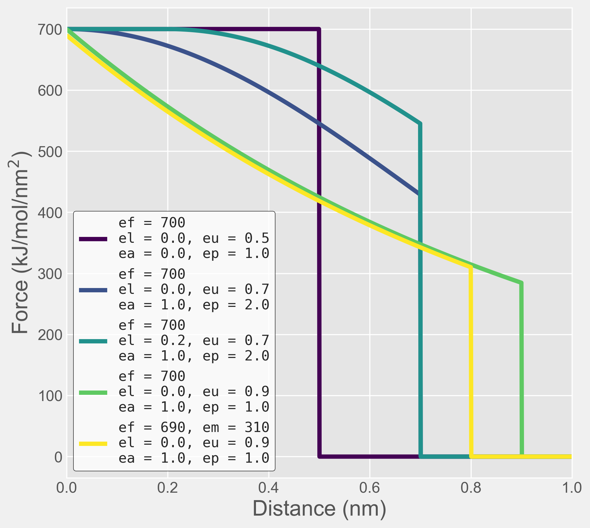

.. _elastic:
================
Elastic Networks
================

The first method applied to maintain the secondary and tertiary structure
of Martini proteins was `Elastic Networks <https://doi.org/10.1021/ct9002114>`_.
In Martini and other coarse-grained models, extra restraints are necessary to
retain folded protein structure in the absense of hydrogen bonding. As the
`Martini protein tutorial <https://cgmartini.nl/docs/tutorials/Martini3/ProteinsI/>`_
suggests, try simulating a protein without them and seeing what happens!

Elastic networks are formed by finding contacts between protein backbone
beads within a particular cutoff distance, and applying harmonic bonds between them,
restraining them at the initial distance throughout your simulation.

Elastic networks are applied in Martinize2 as per the section of the help::

  -elastic              Write elastic bonds (default: False)
  -ef RB_FORCE_CONSTANT
                        Elastic bond force constant Fc in kJ/mol/nm^2 (default: 700)
  -el RB_LOWER_BOUND    Elastic bond lower cutoff: F = Fc if rij < lo (default: 0)
  -eu RB_UPPER_BOUND    Elastic bond upper cutoff: F = 0 if rij > up (default: 0.9)
  -ermd RES_MIN_DIST    The minimum separation between two residues to have an RB the default value is set by the force-field. (default: None)
  -ea RB_DECAY_FACTOR   Elastic bond decay factor a (default: 0)
  -ep RB_DECAY_POWER    Elastic bond decay power p (default: 1)
  -em RB_MINIMUM_FORCE  Remove elastic bonds with force constant lower than this (default: 0)
  -eb RB_SELECTION      Comma separated list of bead names for elastic bonds (default: None)
  -eunit RB_UNIT        Establish what is the structural unit for the elastic network. Bonds are only created within a unit. Options are molecule, chain,
                        all, or aspecified region defined by resids, with followingformat: <start_resid_1>:<end_resid_1>, <start_resid_2>:<end_resid_2>...
                        (default: molecule)

Let's have a look at how to combine these in more detail.

Basic usage
-----------
Without any further consideration, an elastic network can be added to your martinize2 command easily:

``martinize2 -f protein.pdb -o topol.top -x cg_protein.pdb -ff martini3001 -dssp -elastic``

which will apply the default harmonic bond constant (700 kJ/mol/nm^2) between non-successive BB beads
which are < 0.9 nm apart in space.

NOTE! For proteins in martini 3, the default constant is 700 kJ/mol/nm^2. For proteins in martini 2,
a value of 500 kJ/mol/nm^2 may be more appropriate.

Customising cutoffs
-------------------

If your system requires more of a custom cutoff to better reproduce the dynamics of your protein,
the region for the force to be applied in can be customised using the ``-el`` and ``-eu`` flags:

``martinize2 -f protein.pdb -o topol.top -x cg_protein.pdb -ff martini3001 -dssp -elastic -el 0.1 -eu 0.5``

In this example, the elastic network will only be applied between backbone beads which are between 0.1 and 0.5 nm
apart.

Using decays
------------

The strength of the elastic bond can be tuned with distance using an exponential decay function,
which uses the ``-ea`` and ``-ep`` flags as input parameters:

.. math::
    :label: decay

    decay = e^{(- f * ((x - l) ^ p)}

where:

- ``l`` = lower bound  (``-el``)
- ``f`` = decay factor (``-ea``)
- ``p`` = decay power  (``-ep``)

Combining parameters
--------------------

Here we see several examples of how the strength of elastic network harmonic bonds can be tuned.

The first example uses default parameters (albeit a shorter cutoff), such that a constant force is
applied between all backbone beads within the cutoff.

The second and third examples use a slightly longer cutoff, and apply a gentle decay function
to the strength of the network. In the first case, the decay is applied naively, and as such its
strength decays from 0 distance. In the second case, combining the decay with a lower cutoff means that
for backbone beads that are close the elastic network strength is constand, but is lower between pairs slightly
further away.

The fourth example shows a similar function to the second example, but with a longer cutoff and a stronger decay.
(note the form of the exponential decay above)

The fifth example adds an additional parameter ``-em`` into the function. As described in the help, if forces are
calculated to be lower than this force, they are removed and set to zero. Note how the input values are almost identical
to the fourth example, which would otherwise get cutoff at 0.9 nm. Because the decay function reduces the force below
the minimum before the cutoff, it overrides it and the force is zeroed before the upper cutoff anyway.

Defining structural units
-------------------------

By default, martinize2 will look at the structure given in the input file, and construct a distance-based elastic
network, filtered by each molecule. This behaviour is controlled by the `-eunit` flag. If you have multiple molecules
within your input file and would like the way the elastic network is written to be changed, this can be achieved
through different specifications as described in the help above.

For example:
``martinize2 -f protein.pdb -o topol.top -x cg_protein.pdb -ff martini3001 -dssp -elastic -eunit chain``

will limit the unit to individual chains in the system. *i.e.* chain A of your protein will *not* have any elastic
bonds with chain B, and so on.

Conversely,
``martinize2 -f protein.pdb -o topol.top -x cg_protein.pdb -ff martini3001 -dssp -elastic -eunit all``

will write elastic bonds between every molecule in your system in the positions that have been found.

Finally:

``martinize2 -f protein.pdb -o topol.top -x cg_protein.pdb -ff martini3001 -dssp -elastic -eunit 1:100 150:200``

Will write elastic networks internally between residues 1 to 100, and residues 150 to 200, but *not* between either of
these domains, nor between either of these domains and residues 101 to 149.

Visualising elastic networks
----------------------------

If you want to look at your elastic network in VMD to confirm that it's been constructed in the
way that you're expecting, the `MartiniGlass <https://github.com/Martini-Force-Field-Initiative/MartiniGlass>`_
package can help write visualisable topologies to view.
